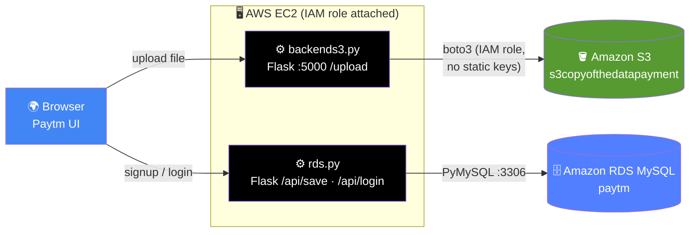

<div align="center">

# 💸 Paytm Clone — AWS Services Project

### A Paytm-style wallet & recharge UI backed by **Flask** APIs on **EC2**, with **Amazon S3** file storage and **Amazon RDS (MySQL)** for user data

<p>


</p>
<p>


</p>

</div>

---

## 🎯 Overview

A front-end Paytm clone (signup, recharge, QR scanner, transaction summary, payment processing) wired to two small **Flask** backends running on an **EC2** instance:

| 🧩 Component | 📄 File | 📝 Role |
|:--|:--|:--|
| 🖥 Frontend | `frontend/*.html` + `style.css` · `responsive.css` | Paytm-style UI |
| ⚙️ S3 API | `backend/backends3.py` | Upload/serve files to **S3** (`s3copyofthedatapayment`) via the EC2 **IAM role** |
| ⚙️ RDS API | `backend/rds.py` | Signup/login against **RDS MySQL** (`paytm` DB) |
| 📜 IAM policies | `backend/s3backendpolicys.txt` | Sample S3 access + bucket policies |

### Frontend pages

`index.html` (landing) · `signup.html` · `main.html` (wallet home) · `recharge.html` · `signuppscanner.html` (QR) · `processing.html` · `summary.html`

---

## 🏗 Architecture



> ✅ Good practice already used: `backends3.py` uses `boto3.client("s3")` with **no hardcoded keys**, relying on the EC2 instance's IAM role.

---

## 🚀 Setup — Step by Step

### 1️⃣ Launch EC2 + attach an IAM role

Attach a role granting `s3:PutObject` / `s3:GetObject` on your bucket (see `backend/s3backendpolicys.txt` for sample policies).

### 2️⃣ Create the S3 bucket & RDS database

```bash
aws s3 mb s3://s3copyofthedatapayment --region <region>

# On RDS MySQL:
mysql -h <RDS_ENDPOINT> -u admin -p
```
```sql
CREATE DATABASE paytm;
USE paytm;
CREATE TABLE users (
  id INT AUTO_INCREMENT PRIMARY KEY,
  email VARCHAR(150) UNIQUE NOT NULL,
  password VARCHAR(255) NOT NULL,
  created_at TIMESTAMP DEFAULT CURRENT_TIMESTAMP
);
```

### 3️⃣ Configure & run the backends

```bash
pip install flask flask-cors boto3 pymysql werkzeug

# Set RDS connection in backend/rds.py (host / password / db) — see Security Notes
python backend/backends3.py    # S3 upload API  (:5000)
python backend/rds.py          # signup/login API
```

### 4️⃣ Serve the frontend

Open `frontend/index.html`, or host the `frontend/` folder behind NGINX / S3 static hosting. Point the fetch URLs at your EC2 public IP.

---

## 🔌 API Reference

| API | Method | Endpoint | Purpose |
|:--|:--|:--|:--|
| S3 | `POST` | `/upload` | Upload a file to the S3 bucket |
| RDS | `POST` | `/api/save` | Create a user (signup) |
| RDS | `POST` | `/api/login` | Authenticate a user |

---

## 🔒 Security Notes

| 🔴 | Finding | Recommendation |
|:-:|:--|:--|
| 🔴 High | `backend/rds.py` contains a hardcoded DB password (`Cloud1234`) | Move DB config to environment variables; rotate the password |
| 🟠 Medium | Passwords stored/compared without hashing | Hash with `bcrypt`/`werkzeug` before storing |
| 🟠 Medium | CORS fully open (`CORS(app)`) | Restrict to your frontend origin |
| 🟢 Good | S3 access uses the EC2 IAM role, not static keys | Keep it that way |

---

<div align="center">

### ⭐ Flask · S3 · RDS · IAM on AWS EC2

</div>
